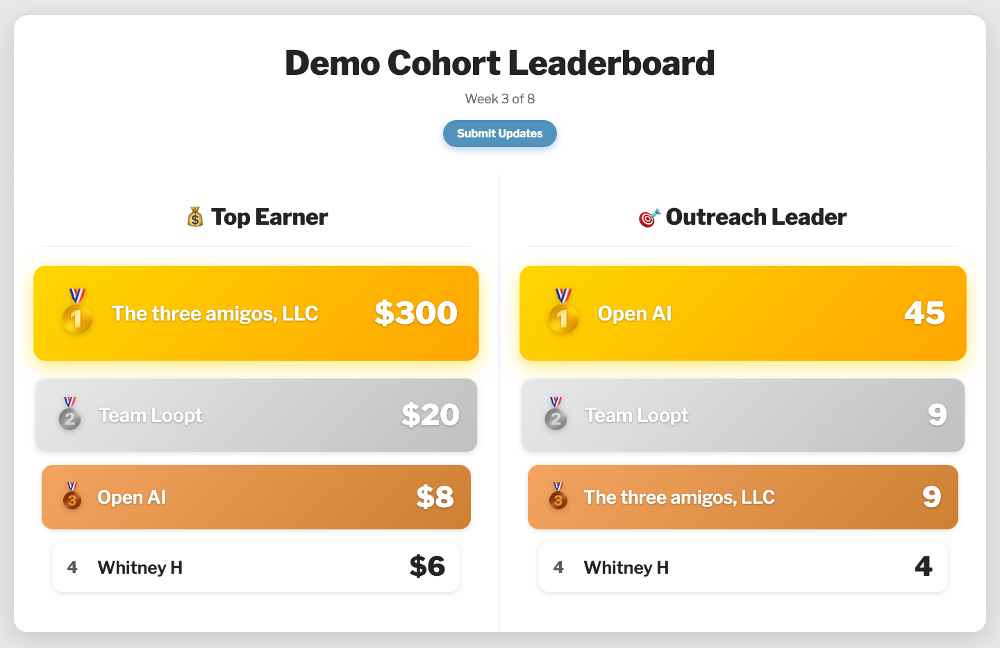

# Cohort Leaderboard

A live leaderboard for entrepreneur programs, accelerators, and cohort
courses. When founders can see where they stand, the pace of the whole
cohort changes: more outreach between sessions, more deals closed, more
progress to show when the group meets.

Founders submit their numbers through a Google Form. This page turns those
submissions into a ranked scoreboard (gold, silver, and bronze podium up
top, live score gaps below) that updates itself all week. It runs entirely
on a Google Sheet you already know how to edit. Free.

**[See a demo](https://cohort-leaderboard.netlify.app/?demo=1)** ·
**[Make your own](https://cohort-leaderboard.netlify.app/make.html)**



Built for the Round Rock pre-accelerator, where it goes up on the projector
at the start of every session.

## How it works

```
Google Form  →  Google Sheet  →  published CSV  →  this page
(founders submit) (you edit anytime)  (no login needed)   (live board)
```

- Every column in your form becomes its own leaderboard (outreach sent,
  revenue closed, interviews done, whatever you track).
- Columns with "revenue", "sales", "earner", or "$" in the header format as
  currency.
- Edit the Sheet directly anytime: fix a typo, delete a junk row, rename a
  team. The board follows.
- New submissions appear within about 5 minutes (Google caches published
  CSVs), and the page re-checks automatically, so a projector display stays
  current all session.

## Quickstart (no code, ~20 minutes)

### 1. Copy the two templates

- **[Copy the template Form](https://docs.google.com/forms/d/17q-DL4U1WSOZMjLW-1eFvITgf3WCB2dZmNdtcMeoSps/copy)**
  (sign in to Google if asked). Then, in your copy: click **Publish** (top
  right; copies arrive unpublished and can't accept submissions until you
  do), then open the Responses tab and click **Link to Sheets** to create
  your response spreadsheet.
  Rename or add metric questions freely; every question after the name
  becomes its own leaderboard.
- **[Copy the template Settings sheet](https://docs.google.com/spreadsheets/d/1ERtFGoGEOolNR0qk1G7O0xisJzjbQKsIxeCfuum0R64/copy)**.
  Edit the title and dates, and paste your Form's share link into the
  "Submit button URL" row (that's what the board's Submit button opens).

Prefer to build from scratch? Everything the templates contain is documented
in [docs/template-sheet-setup.md](docs/template-sheet-setup.md).

Running a university program or anywhere real names are sensitive? Tell
participants to enter a company name or handle. The board shows whatever
they type.

### 2. Publish both as CSV

In each spreadsheet: **File > Share > Publish to web**, pick the tab (the
Form-responses tab in one, Settings in the other), choose
**Comma-separated values (.csv)**, publish, copy the URL.

If Publish to web is missing, your Google Workspace admin has disabled it;
redo the sheets from a personal Google account.

### 3. Get your link

Go to the **[leaderboard builder](https://cohort-leaderboard.netlify.app/make.html)**,
paste the two URLs, done. Bookmark the link it gives you; that's your live
board.

## Settings sheet reference

Each row names a setting in column A; your value goes in column B. Row
order doesn't matter, and rows the board doesn't recognize (headers, notes,
spacers) are ignored, so you can't break it by rearranging.

| Setting (column A) | Your value (column B) |
|-----|-------|
| Title | Board title, the big headline |
| Date range | Week label, shows in the subtitle |
| Explainer | Text after the date in the subtitle |
| Disclaimer | Footer small print |
| Powered by text | Blank shows a small Cohort Leaderboard credit |
| Powered by URL | Where the powered-by text/logo links |
| Submit button text | e.g. "Submit Updates" |
| Submit button URL | Your Google Form link; blank hides the button |
| Show score gap | ON shows "X behind" under scores |
| Stack on mobile | ON = one column on phones |
| Multiple submissions | blank (every submission is its own row), SUM, LATEST, or MAX — see below |
| Logo URL | Footer logo image (optional) |
| Count since | e.g. `12/8/2025` — older submissions are ignored (optional) |

(The older column-A-by-row-number format from earlier versions still works;
the board auto-detects which one you're using.)

## Multiple submissions and weekly resets

Founders submit the form more than once. The "Multiple submissions" setting
decides what the board does with that:

- **blank** — every submission appears as its own row (original behavior).
- **SUM** — one row per team, scores added up. Right for cumulative counts
  like outreach ("submit whenever, it all adds up").
- **LATEST** — one row per team, most recent submission wins. Right when the
  form asks for running totals ("what's your revenue so far?").
- **MAX** — one row per team, best submission wins.

For a weekly reset, put the week's start date in the "Count since" row
(like `12/8/2025`) and change it each Monday. Older submissions stop counting but stay in your
sheet, so you keep the full history and never delete data.

## Troubleshooting

- **Board not updating?** Google caches published CSVs for ~5 minutes. Wait
  five, then hard-refresh. The page also re-fetches itself on that interval.
- **"Could not load leaderboard data"?** One of the two URLs isn't a
  published-CSV link. Re-do File > Share > Publish to web in each sheet and
  make sure the copied URL ends in `output=csv`.
- **No Publish to web option?** Your Google Workspace admin disabled it.
  Rebuild the two sheets from a personal Google account.
- **A team shows up twice with different names?** Self-reported names vary
  ("Acme" vs "acme inc"). Edit the response sheet's name cells so they match;
  aggregation matches names case-insensitively but not fuzzily.
- **Renamed a form question mid-cohort?** The column header changes, and the
  board's column title follows it. Old responses stay in the old column, so
  avoid renaming questions once submissions exist.

## Self-hosting (optional)

The hosted builder needs no account at all. If you'd rather run it on your
own domain:

1. [Deploy to Netlify](https://app.netlify.com/start/deploy?repository=https://github.com/cameronha/cohort-leaderboard)
   (free tier is plenty), or drag this folder onto https://app.netlify.com/drop.
2. Copy `config.example.js` to `config.js`, paste your two published-CSV
   URLs, redeploy. With `config.js` set, the deployment serves only your
   board and ignores query params.

## Want help?

If you'd rather someone set this up for you, or you want help designing the
metrics, stakes, and cadence that make a leaderboard actually move a cohort,
reach out: [actionworks.co](https://actionworks.co).

## License

MIT. Use it, fork it, run your program on it.
